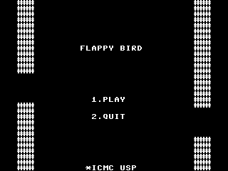
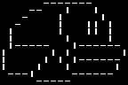
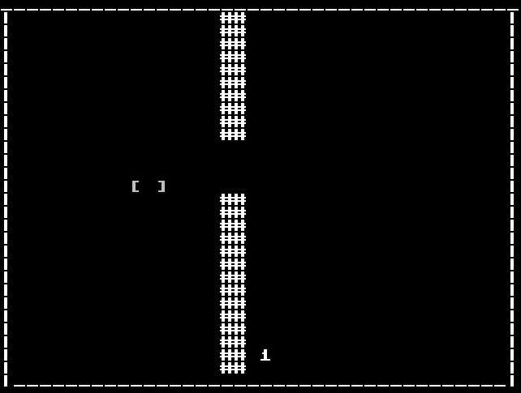
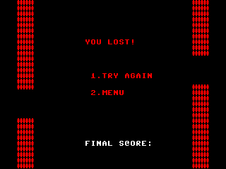

# Flappy Bird Assembly 🕹️

Projeto desenvolvido para a disciplina **SSC0119 - Prática em Organização e Arquitetura de Computadores**.  
Este jogo implementa uma versão do clássico **Flappy Bird** utilizando **Assembly**, demonstrando conceitos de baixo nível e otimizações específicas para arquiteturas de computadores.

---

[**Tela Principal**](#tela-principal-) · [**Estrutura do Projeto**](#estrutura-do-projeto-) · [**Instalação**](#instalação-) · [**Modo de Jogar**](#modo-de-jogar-) · [**Link do Vídeo**](#link-do-vídeo-) · [**Contribuição**](#contribuição-) · [**Licença**](#licença-) · [**Alunos**](#alunos-)

---

## Tela Principal 🎮

<p align="center">
  
</p>

Na tela principal, o jogador encontra o menu inicial com opções para iniciar o jogo e visualizar as instruções. A estética remete ao clássico Flappy Bird, mas com a identidade própria do projeto implementado em Assembly.

---

## Estrutura do Projeto 🔗
A estrutura do projeto é organizada da seguinte forma:

  ```bash
📂 FlappyBirdAssembly
│-- 📜 main_code.asm        # Código principal do jogo
│-- 📜 main_code.mif        # Arquivo do jogo para rodar no simulador
│-- 📜 charmap.mif          # Arquivo auxiliar para rodar o simulador
│-- 📂 Personagem           # Código relacionado ao personagem
│   ├── 📜 personagem.asm   # Descrição visual do personagem
│   ├── 📜 personagem.png   # Descrição visual do personagem
│-- 📂 Ferramentas          # Executáveis do montador e simulador
│   ├── 📜 mont             # Compilador dos arquivos asm
│   ├── 📜 sim              # Simulador para rodar o jogo
│-- 📂 Images               # Recursos gráficos do jogo
│   ├── 📜 Menu.png         # Tela principal
│   ├── 📜 Tela_derrota.png # Tela de game over
│   ├── 📜 game.jpeg        # Captura de tela do jogo em execução
│-- 📂 CPU                  # Recursos para a implementação da CPU com a Unidade de Controle (UC) inclusaSimulador_Linux
│-- 📂 Simulador_Linux      # Arquivos para o simulador e montador
│-- 📜 README.md            # Documentação do projeto
  ```

---

## Instalação 💻
### Requisitos 📋

- **Sistema Operacional:**  
  - Linux ou um ambiente compatível com a execução de programas em Assembly.

- **Ferramentas Necessárias:**  
  - 🛠️ **GCC** – Para compilação do montador e simulador.  
  - 🔧 **GTK** – Para compilar o simulador.  
  - 🎮 **Montador e Simulador do projeto** – `montador` e `sim`.  
  - 🖥️ **Terminal** – Com suporte para execução de binários.  


### Passos Completos para Compilação e Execução do Jogo:

1. Clone o repositório e entre no diretório do projeto:
  ```bash
   git clone https://github.com/SeuUsuario/FlappyBirdAssembly.git  
   cd FlappyBirdAssembly/
  ```
2. Compile o simulador:
  ```bash
   cd Simulador_Linux/simulador_fonte  
   sh compila.sh  
   cp sim ../../Ferramentas/sim  
   chmod +x ../../Ferramentas/sim  
   cd ..
   cd ..
  ```

3. Compile o montador:
  ```bash
   cd Simulador_Linux/montador_fonte  
   gcc *.c -o montador  
   cp montador ../../Ferramentas/montador  
   chmod +x ../../Ferramentas/montador  
   cd ..
   cd ..
  ```

4. Compile o código Assembly do jogo:
  ```bash
   ./Ferramentas/montador main_code.asm main_code.mif
  ```

5. Execute o jogo no simulador:
  ```bash
   ./Ferramentas/sim main_code.mif charmap.mif
  ```
---

### 📌 Observação:
- Caso já existam arquivos `montador` e `sim` na pasta `Ferramentas`, substitua-os pelos gerados acima.
- Sempre verifique as permissões de execução (`chmod +x` pode ser necessário).

🚀 Agora o jogo estará pronto para ser executado!

--- 

## Modo de Jogar ▶️

O jogo consiste em controlar o pássaro para que ele evite os obstáculos (semelhantes aos tubos do Flappy Bird) e se mantenha no ar o máximo possível. A pontuação aumenta à medida que o pássaro passa pelos obstáculos.

### Controles:
- **`1 e 2`**: Seleção das opções no menu principal e na tela de derrota. 
- **`ESPACO`**: Faz o pássaro subir (realiza o flap).

<p align="center">
  
</p>
<p align="center">
  
</p>


### Funcionamento Durante o Jogo:
- **Pontuação:** Cada obstáculo ultrapassado incrementa a pontuação.
- **Colisões:** Se o pássaro colidir com um obstáculo, o jogo é finalizado e a **Tela de Derrota** é exibida.
- **Tela de Derrota:** Exibe a pontuação final e oferece a opção de reiniciar o jogo.

<p align="center">
  
</p>

---

## Link do Vídeo 🎥

Assista à apresentação do projeto:  
[Assista aqui](https://www.youtube.com/watch?v=LST4KJSebKg)

---

## Contribuição 🤝

Contribuições são bem-vindas!  
Sinta-se à vontade para abrir **Issues** ou enviar **Pull Requests** para melhorias e correções.

---

## Licença 📄

Este projeto está sob a licença **MIT**.

---

## Aluno 👨‍🎓

| Nome Completo                | Número USP       | GitHub                                                           |
|------------------------------|------------------|------------------------------------------------------------------|
| Vinicius Neves Gustierrez    | **14749363**     | [GitHub](https://github.com/Vinicius-GN)                           |


